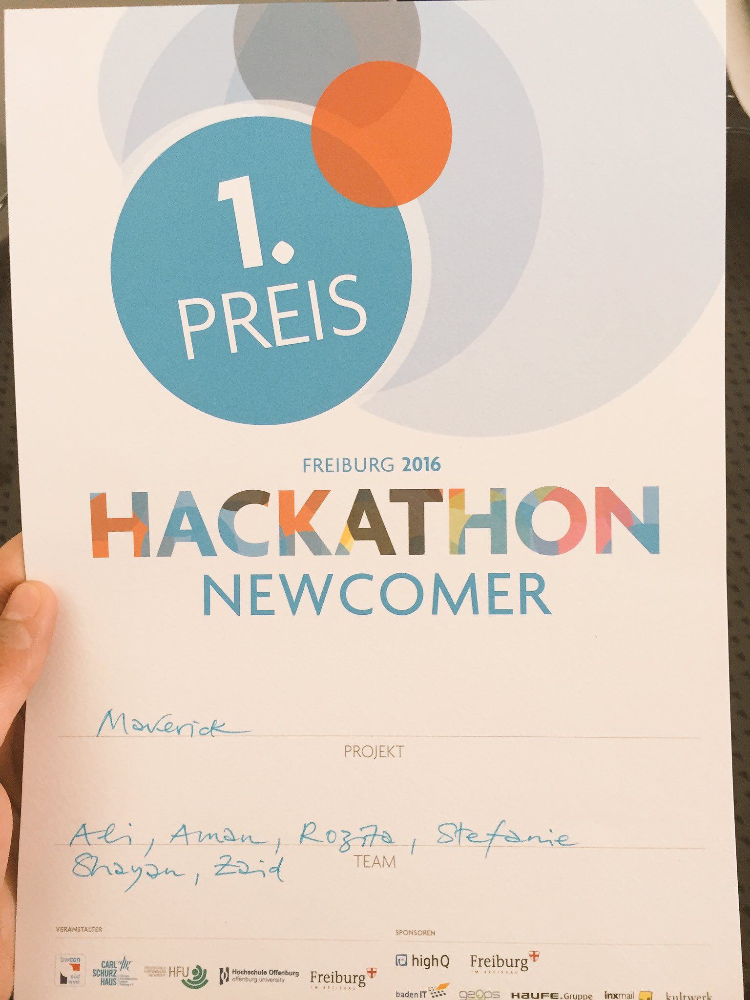

  
## Idea
An mockup app for helping newcomers in Freiburg, Germany and get rewards.
Work in progress. Coming fairly soon to a github repository.

## Award
Won 1st prize in Freiburg Hackathon 2016 (https://hackathon-freiburg.de/#hackathon-2016)

## Technology
* CSS frameworks, e.g. BootStrap
* Sass
* Cordova
* AngularJS

## Team
Muazzam Ali, Amanullah Tariq, Zaid ur Rehman, Shayan Jamal, Rozitha, Stefine 

## Contact
#### Developer/Projects spokesman
* Homepage: 
* e-mail: 
* other communication/social media

## License 

