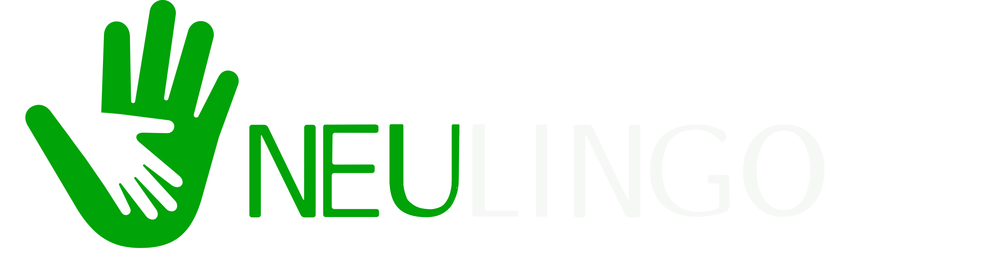

  
An mockup app for helping newcomers in Freiburg, Germany and get rewards.
Work in progress. Coming fairly soon to a github repository near you.

## Idea

## Technology
* CSS frameworks, e.g. BootStrap
* Sass
* Cordova
* AngularJS

## Team
Muazzam Ali, Amanullah Tariq, Zaid ur Rehman, Shayan Jamal, Rozitha, Stefine 

## Contact
#### Developer/Projects spokesman
* Homepage: 
* e-mail: 
* Twitter: [@twitterhandle](https://twitter.com/twitterhandle "twitterhandle on twitter")
* other communication/social media

## License 
* see [LICENSE](https://github.com/username/sw-name/blob/master/LICENSE.md) file

